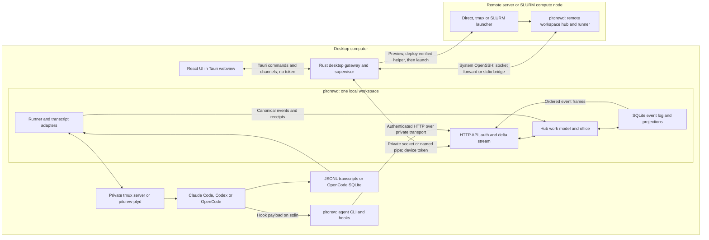

# Architecture for contributors

PitCrew is a pre-alpha desktop app with a Rust daemon and a React UI. A workspace has its own
hub, event log and runner. The desktop can open several workspaces, including ones on servers
and SLURM compute nodes; those are separate hubs reached over SSH. A central hub coordinating
remote runners is **not built yet**. This page describes the code on `main`; the
[briefs](build/briefs/README.md) track work still to do.

## Processes and connections

The **desktop app** supervises a local `pitcrewd`, or adopts one already running. It stops only
a daemon it started. The webview calls the Rust gateway for requests and WebSockets; it cannot
choose headers or obtain tokens. The gateway owns remote connections, keychain pairing, SSH
prompts, notifications and the tray. See the [desktop README](../apps/desktop/src-tauri/README.md)
and [gateway contract](build/contracts/desktop-gateway.md).

**`pitcrewd`** is the composition root. It wires the authenticated API, the hub's work service,
store, transcript runner, recap index and deterministic `@office` loop into one process. On first
run, setup creates the person and local machine before the runner and office start. `--demo`
seeds a synthetic workspace and watches no agent homes unless `--homes` is explicitly supplied.
See the [daemon README](../crates/daemon/README.md).

The **runner** watches source transcripts and controls sessions through the runtime interface.
It prefers its own tmux server (3.2 or newer), with no user tmux configuration; otherwise it uses
`pitcrew-ptyd` beside the daemon, never one found on `PATH`. The sidecar owns PTYs (ConPTY on
Windows) so terminals can survive daemon restarts. tmux also keeps its panes alive. A supervisor
that kills an entire process group or service control group can still end those terminals; the
[daemon deployment notes](../crates/daemon/README.md#terminals) explain the required lifecycle.
No runtime means transcript watching still works, but starting or controlling a terminal does not.

**`pitcrew`** is the agent CLI, not a device administration client. Its ordinary verbs require a
registered agent token; the seeded demo provides one. Hooks accept the engine's JSON on stdin,
report through the API, and silently return zero even if the daemon is unavailable. A successful
hook process exit therefore does not prove delivery. The hub derives authorship and ownership
from the token, rather than trusting fields in the payload.

For a **remote workspace**, system OpenSSH uses the person's SSH configuration. The gateway
previews a plan, verifies a bundled helper against checksums compiled into the desktop, uploads
it to private versioned directories, then uses a direct, tmux or SLURM launcher. SLURM submits
exactly the previewed script and checks job ownership before cancellation. The connector reaches
the helper's private Unix socket through an SSH forward, or `pitcrewd connect` over stdio;
`srun` uses framed stdio. This needs no public daemon TCP port, remote compiler or remote internet.
See the [remote README](../crates/remote/README.md) and [packaging README](../packaging/README.md).

## From a transcript to the UI

1. Source adapters incrementally read Claude Code and Codex JSONL or OpenCode's SQLite store.
   The runner persists source cursors, discovers sessions and emits canonical protocol events
   with receipts pointing back to source records. Transcript pages remain source-backed; the
   event log is not a second full transcript archive.
2. The hub's single work service validates commands and appends authored events to SQLite.
   Store projections update in the append transaction. Work tables and activity indexes give
   the API efficient reads; migrations have stream-specific number ranges.
3. Recaps are derived from the event log, with receipted UTF-8 byte spans. Today's summarizer is
   rule-based. The deterministic office proposes or applies bounded actions; the hub checks
   those actions again, including who may answer asks and move tasks to done.
4. The API serves snapshots and `/v1/stream`. A stream begins with `hello {rev, log}`, then
   ordered event batches (a default 75 ms batching window). Reconnection with `since` resumes
   missed revisions; a changed log or revision gap makes the client refetch.
5. The UI data layer patches full objects and coalesces query invalidation. Each desktop
   workspace has its own QueryClient and stream, so switching workspaces cannot reuse another
   one's cached data. Recaps refetch when their source activity changes.

Rust wire types live in [protocol](../crates/protocol/src/lib.rs); the UI currently has
[hand-written copies](../apps/ui/src/data/types.ts). The written [API contract](build/contracts/api-v1.md)
is authoritative when the mock and daemon disagree. The mock is a fixture development server,
with canned terminal output and static recap fixtures, not a persistence or security substitute.

## Crate and app map

Ownership is enforced by [ownership.json](build/ownership.json); the
[ownership guide](build/ownership.md) explains branches and shared seams.

| Path | Stream | Responsibility |
|---|---|---|
| `crates/protocol` | 0 | Domain and wire types, IDs, events, transcript and recap shapes, protocol versions. |
| `crates/interfaces` | 0 | Runtime and source-adapter traits, plus in-memory fakes. |
| `crates/fixtures` | 0 | Synthetic workspaces, transcripts and private-home test helpers. |
| `crates/daemon` | 0 | `pitcrewd`: lifecycle and composition of services and transports. |
| `crates/ingest` | A | Claude Code, Codex and OpenCode transcript adapters. |
| `crates/runtime` | B | Private tmux runtime, PTY client, terminal buffers and selection. |
| `crates/ptyd` | B | `pitcrew-ptyd`: independent PTY/ConPTY supervisor. |
| `crates/store` | C | SQLite append-only event log, migrations and projections; migration ranges have separate owners. |
| `crates/runner` | D | Watches sources, tracks cursors and sessions, consumes hooks and controls terminals. |
| `crates/hub-work` | E | Work model, command validation, projections, activity and recap indexes. |
| `crates/recap` | F | Activity blocks, receipted summaries and day paragraphs. |
| `crates/office` | F | Deterministic back-office rules, caps and action application seam. |
| `crates/sync-github` | G | Read-only GitHub sync core, transport seam and field-ownership intents. |
| `crates/sync-jira` | G | Read-only Jira Cloud/Data Center sync, sharing GitHub's transport and intent abstractions. |
| `crates/auth` | H | Scoped tokens, private state files and token registry. |
| `crates/api` | H | HTTP/WebSocket routes, private transports, authentication and bounded streams. |
| `crates/cli` | I | `pitcrew`, hook delivery and hook installation. |
| `crates/remote` | J | OpenSSH, askpass binary/bridge, probe, helper deploy, launchers and tunnels. |
| `apps/desktop/src-tauri` | K | Tauri shell, privileged gateway, daemon supervision and remote pairing. |
| `apps/ui` foundation | L | Design, shell, data layer, build configuration and common UI tests. |
| `apps/ui/src/console` | M | Agent console, transcripts and terminal viewing/control. |
| `apps/ui/src/projects` | N | Projects, tasks, Inbox and recap views. |
| `apps/ui/src/onboarding` | O | First-run and remote-connect wizards; some import steps still have only fakes. |
| `crates/legacy` | O | Legacy importer scaffold; implementation is not built yet. |
| `apps/mock-hub` | 0 | In-memory API fixture server for UI development and tests. |
| `packages/tokens` | 0 | Shared visual design tokens. |
| `benches` and `packaging` | P | Performance harnesses, installers and release checks. |
| `fuzz` and `docs/security` | Q | Fuzz harnesses and security analysis. |

## Trust boundaries

The [threat model](security/threat-model.md#4-trust-boundaries) records controls, residual gaps
and tests. Its scope excludes malware already running as the user or administrator; agents run
with the user's OS rights. An agent token limits API authority, but is not a process sandbox.

**Webview to gateway (B1/B2).** Untrusted transcript and terminal content enters the UI. Production
uses bundled assets, a restrictive CSP and narrowly scoped Tauri capabilities. The gateway
validates paths, methods, sizes and timeouts and adds tokens on the native side. Browser API access
is development-only. A debug desktop trusts the process on `127.0.0.1:5173`, so start Vite first
and retain its strict port check.

**Local API and agent hooks (B2/B4–B7).** Private Unix sockets or current-user Windows pipes check
ownership before sending credentials; bearer scopes and command validation still apply. Loopback
TCP is explicitly for development and remains reachable by other local users. Source files,
hook JSON and terminal bytes are untrusted, with bounded parsing and rendering. Tests use
synthetic homes and stand-in CLIs, never a contributor's real agent state.

**SSH, helpers and scheduler (B8/B9/B11).** SSH authenticates the transport; a remote server's
names, prompts and API responses remain untrusted. Local key-unlock prompts are distinguished
from server password prompts; prompting needs OpenSSH 8.4 or newer. Helper checksums, private
paths and job owner checks protect deployment and control. A site recipe is trusted executable
configuration, so its module setup must be reviewed before use.

**Work model, office and trackers (B10/B12).** Office actions carry receipts and pass hub checks;
they cannot approve a person's ask just because a rule proposes it. Tracker text is untrusted.
The current tracker crates are read-only cores; approval-gated outward writes are not built yet.

## Integration still to do

The daemon currently has no hub dispatcher: task dispatch returns `503` and records nothing.
Starting a session with `agent` or `task` also needs runner adoption of the hub's session ID.
Manual session linking and passing workstream folder/branch locations to the runner are not
built yet. GitHub/Jira transport wiring into the daemon, hub application of sync intents, the
write-approval queue and outward writes are not built yet. Onboarding's scan/import backend and
the legacy importer are not built yet. These limits matter when comparing a working mock screen
with a real daemon; see [getting started](getting-started.md) and the stream cards before choosing
an integration task.
